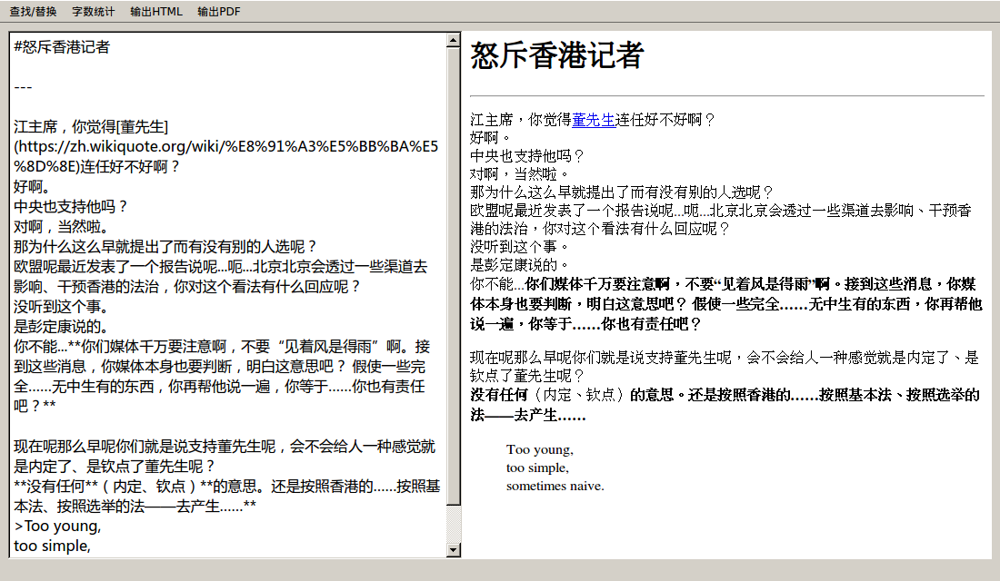

#toyoung  
---  
一个极简风格的Markdown编辑器。  
  
###ScreenShot  
  
  
###Feature  
* 自动保存  
* html/pdf输出  
  
###Support  
Windows/Linux/OS X  
  
###Depends  
Python3  
markdown  
pyqt4  
  
###Usage  
####Linux/OS X:  
安装Python3;  
安装PyQt4;  
安装依赖:  
> $ sudo pip3 install --upgrade markdown  
  
运行:  
> $ python3 toyoung.py test.md  
  
####Windows:  
下载打包版[点我](https://github.com/bieberg0n/toyoung/releases)  
  
